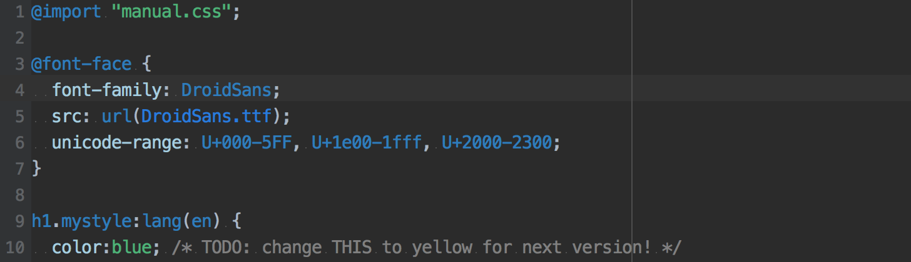

WebStorm color scheme
=====================

+ theme based on [Darcula theme](https://draculatheme.com/)  
+ color scheme similar to [Webpack official website](https://webpack.js.org/)

Fonts
=====
Monospaced

Colors
======
+ Language Default

+ javaScript

+ HTML

+ CSS

+ JSON

Installation
============
+ Open your WebStorm
+ Go to File -> Import Settings
+ Choose colorScheme.jar
+ Restart WebStorm

LICENSE
=======
This project is under the MIT license. See the [LICENSE](LICENSE) file for the full license text.

